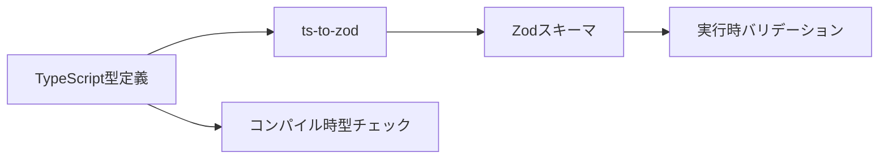

# Type-First Validation with ts-to-zod

このプロジェクトでは、TypeScriptの型定義からZodスキーマを自動生成する**型ファーストアプローチ**を採用しています。

## 🎯 概要

従来の方法では、Zodスキーマを手動で書いてから型を生成していましたが、新しいアプローチではTypeScriptの型定義を書いて、そこからZodスキーマを自動生成します。



## 🚀 使用方法

### 1. 型定義の作成

`model/typeDefinitions.ts` で型を定義します：

```typescript
/**
 * ユーザー情報の型定義
 * @tstoz
 */
export interface User {
  id: number;
  name: string;
  email: string;
  selected?: boolean;
}
```

### 2. スキーマの自動生成

```bash
npm run generate-schemas
```

これにより `model/generatedSchemas.ts` が自動生成されます。

### 3. バリデーションの使用

```typescript
import { User, UserSchema, validateData } from './services/validationV2';

const userData: User = { id: 1, name: 'Test', email: 'test@example.com' };
const result = validateData(UserSchema, userData);

if (result.success) {
  console.log('Valid user:', result.data);
} else {
  console.log('Validation errors:', result.errors);
}
```

## 📁 ファイル構成

```
services/
├── model/
│   ├── typeDefinitions.ts    # 型定義（手動管理）
│   └── generatedSchemas.ts   # 自動生成されたZodスキーマ
├── validationV2.ts       # 新しいバリデーション関数
├── validationAdapter.ts  # 既存コードとの互換性レイヤー
└── typeFirstDemo.ts      # 使用例とデモ
```

## ✅ 利点

### 1. **Single Source of Truth**
- 型定義が唯一の情報源
- スキーマとの同期問題が解決

### 2. **自動同期**
- 型を変更 → スキーマ自動更新
- 手動でスキーマを書く必要なし

### 3. **型安全性**
- コンパイル時: TypeScriptの型チェック
- 実行時: Zodのバリデーション

### 4. **開発体験の向上**
- IDEの自動補完
- リファクタリング支援
- インテリセンス

### 5. **保守性**
- 型変更の影響範囲が明確
- コンパイルエラーで変更箇所を特定

## 🔧 開発フロー

### 新しい型の追加
1. `model/typeDefinitions.ts` に型を追加
2. `npm run generate-schemas` 実行
3. 生成されたスキーマを使用

### 既存の型の変更
1. `model/typeDefinitions.ts` の型を変更
2. `npm run generate-schemas` 実行
3. TypeScriptエラーを修正
4. テストを実行

### CI/CDでの自動化
```yaml
# GitHub Actions例
- name: Generate Schemas
  run: npm run generate-schemas

- name: Check for changes
  run: git diff --exit-code model/generatedSchemas.ts
```

## 🧪 テスト

```bash
# 型ファーストバリデーションのテスト
npm test __tests__/services/validationV2.test.ts

# デモの実行
npm run demo:type-first
```

## 📋 使用可能なコマンド

| コマンド | 説明 |
|---------|------|
| `npm run generate-schemas` | Zodスキーマを自動生成 |
| `npm run build-schemas` | 生成 + 成功メッセージ |
| `npm test validationV2` | 型ファーストテスト実行 |

## 🔄 既存コードからの移行

### 段階的移行

1. **新しい型を型ファーストで作成**
2. **既存のスキーマを段階的に置換**
3. **互換性レイヤーを使用して段階移行**

### 互換性

```typescript
// 既存コード（そのまま動作）
import { UserSchema, validateData } from './validation';

// 新しい方式
import { UserSchema, validateData } from './validationV2';
```

## 🎯 ベストプラクティス

### 1. 型定義の命名
- PascalCaseを使用
- `@tstoz` コメントを追加

### 2. オプショナルフィールド
```typescript
interface User {
  id: number;
  name: string;
  email?: string; // オプショナル
}
```

### 3. ネストした型
```typescript
interface User {
  profile: {
    avatar: string;
    bio?: string;
  };
}
```

### 4. 関数型の除外
```typescript
// ❌ 関数型は生成対象外
interface ApiEndpoints {
  detail: (id: number) => string; // ts-to-zodで処理できない
}

// ✅ 手動定義
export const ApiEndpoints = {
  detail: (id: number) => \`/api/users/\${id}\`
};
```

## 🚨 注意点

1. **関数型は自動生成できません** - 手動定義が必要
2. **高度なZod機能** - `.refine()`, `.transform()` などは手動追加
3. **生成ファイルの編集禁止** - `model/generatedSchemas.ts` は自動生成
4. **型の削除** - 使用箇所を確認してから削除

## 🔗 関連ツール

- [ts-to-zod](https://github.com/fabien0102/ts-to-zod) - 型からスキーマ生成
- [Zod](https://github.com/colinhacks/zod) - TypeScriptファーストバリデーション
- [TypeScript](https://www.typescriptlang.org/) - 型システム

## 📈 パフォーマンス

型ファーストアプローチは実行時パフォーマンスに影響しません：
- スキーマ生成: ビルド時
- バリデーション: 従来のZodと同等
- 型チェック: コンパイル時

## 🤝 コントリビューション

1. 型定義を追加・変更
2. スキーマ生成を実行
3. テストを追加
4. ドキュメント更新
5. プルリクエスト作成

---

**型ファーストアプローチで、より安全で保守しやすいコードを書きましょう！** ✨